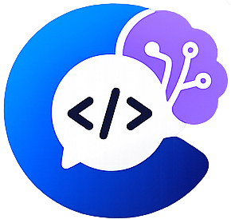

<div align="center">



# CSORA

**CS 핵심 개념을 문제로 빠르게 점검하는 학습 플랫폼**

틀린 문제는 자동으로 복습 예약되고, 친구와 실시간 1:1 대결도 즐길 수 있습니다.

[](https://nextjs.org/)
[](https://www.typescriptlang.org/)
[](https://supabase.com/)
[](https://vercel.com/)

🔗 **[csora.co.kr](https://csora.co.kr)**

</div>

---

## 📌 프로젝트 소개

CS 지식을 단순 암기가 아닌 **문제 풀이 → 오답 복습 → 실력 확인** 사이클로 효율적으로 습득할 수 있도록 설계한 웹 서비스입니다.

자료구조, 알고리즘, OS, 네트워크, DB, 컴퓨터구조, 소프트웨어공학 7개 영역 **1,500+ 문제**를 제공합니다.

---

## ✨ 주요 기능

**🧠 학습**
- 카테고리별 랜덤 퀴즈 (최근 3세션 문제 자동 제외로 다양성 확보)
- 오답 복습 스케줄링 — 1·3·7·30일 간격 반복 학습 (에빙하우스 망각 곡선)
- 시간제한 모드 — 문제당 15초, 압박 속 실력 체크
- 오늘의 문제 — 매일 00:00 KST 갱신, 전체 참여자 정답률 공개

**⚔️ 대결**
- Supabase Realtime Broadcast 기반 실시간 1:1 퀴즈 대결 (10문제, 문제당 20초)
- 연속 쌍방 스킵 시 5초 단축 타이머, 2회 연속 무효 처리
- 대결 누적 승·무·패 기록 및 친구 패널 실시간 반영

**📊 성장 추적**
- 유저 레벨(XP) 시스템 — 퀴즈·출석·문제 등록·대전으로 경험치 획득, 최대 200레벨
- 카테고리별 단계(입문→학습→숙련→마스터) + 정답률 등급(브론즈/실버/골드)
- 연속 출석 스트릭, 뱃지·업적 30종
- 주간 목표 달성 포인트 수령 (매주 월요일 00:00 KST 초기화)
- 마이페이지 카테고리별 오답 상세 분석

**🌐 커뮤니티**
- 문제 제보 게시판 (좋아요·신고·거절 후 재요청, 등록 시 유사 문제 하이브리드 검색으로 중복 방지, 관리자가 동의어 그룹을 직접 추가·관리 가능)
- 내 게시글에 댓글이 달리면 실시간 알림
- 친구 1:1 채팅 (세션 단위 휘발성 — 로그아웃 시 개인별 정리)
- 카카오톡 결과 공유 — Kakao SDK `sendScrap` (공유자 정답률 OG 메타 포함)
- 북마크, Supabase Realtime 알림, PC 데스크톱 알림(탭 깜빡임·OS 알림·작업표시줄 뱃지)

**🔧 관리자**
- 문제 승인·거절·블라인드, 사용자 관리(비활성화/소프트딜리트와 별도로 계정 완전삭제 지원), 금칙어 관리
- GPT 기반 문제 배치 생성
- 애널리틱스 대시보드(KST 자정 기준 일일 집계), 일일 Digest 메일 (GitHub Actions, 매일 08:00 KST)

**🔎 검색엔진 노출**
- robots.txt·sitemap.xml·JSON-LD 구조화 데이터, 키워드 메타태그
- 구글 서치콘솔·네이버 서치어드바이저 소유권 확인 및 사이트맵 제출

**🔐 보안**
- 상태 변경 API 전반에 소유권·권한 서버 검증 (클라이언트 UI 숨김은 보안으로 취급하지 않음)
- DB 기반 레이트리밋 — 댓글·신고·문의·채팅 스팸 및 콘텐츠 스크래핑 방지
- 퀴즈 정답은 서버 채점 시점에만 접근 (플레이 화면에 정답 필드 미노출), 세션 재제출 레이트리밋으로 보상 파밍 방지
- 대결 생성 친구쌍 단위 일일 상한으로 알트 계정 XP 파밍 방지
- 계정 완전삭제는 FK RESTRICT 관계(풀이기록·알림·좋아요·문의·주최한 대결방 등)를 트랜잭션으로 먼저 정리한 뒤 유저를 삭제해 참조 무결성 오류 없이 처리

---

## 🛠 기술 스택

| 구분 | 기술 |
|------|------|
| **Frontend** | Next.js 15 (App Router) · TypeScript strict · Tailwind CSS · TanStack Query |
| **Backend** | Next.js API Routes · Prisma ORM v7 · NextAuth.js v5 (Google / 카카오 OAuth) |
| **Database** | Supabase (PostgreSQL) · Realtime Broadcast |
| **인프라** | Vercel · GitHub Actions (Cron) |
| **테스트** | Vitest |

---

## 🏗 시스템 아키텍처

```
┌─────────────────────────────────────────────────────────┐
│                  Client (Browser / PWA)                  │
│         Next.js App Router  ·  TanStack Query            │
└──────────────────┬──────────────────┬───────────────────┘
                   │ HTTP             │ WebSocket
                   ▼                  ▼
  ┌────────────────────────┐  ┌──────────────────────────┐
  │  Next.js API Routes    │  │  Supabase Realtime       │
  │  (Vercel Serverless)   │  │  Broadcast Channel       │
  └──────────┬─────────────┘  └──────────────────────────┘
             │ Prisma ORM v7
             ▼
  ┌────────────────────────┐  ┌──────────────────────────┐
  │  Supabase PostgreSQL   │  │  GitHub Actions (Cron)   │
  └────────────────────────┘  │  Daily Digest 08:00 KST  │
                               └──────────────────────────┘
```

**주요 설계 결정**

| 결정 | 이유 |
|------|------|
| Supabase Realtime Broadcast (대결) | WebSocket 직접 관리 없이 채널 기반 양방향 동기화 |
| Broadcast + 폴링 fallback (1s / 500ms) | Realtime 연결 지연 시 사용자 경험 보장 |
| `answer` 필드 서버 전용 접근 | 클라이언트로 정답 노출 방지 |
| DB 테이블 기반 레이트리밋 (Redis 없이) | 프로젝트 규모상 외부 인프라 없이 Postgres만으로 스팸·파밍·스크래핑 방지 |
| Prisma 트랜잭션으로 통계 업데이트 | 동시 제출 시 카운트 정합성 보장 |
| 서버사이드 페이지네이션 전면 적용 | 대규모 목록 API 성능 최적화 |
| Fisher-Yates 셔플 | `Array.sort(Math.random)` 편향 제거 |
| KST 기준 일일·주간 초기화 | UTC 사용 시 한국 기준 새벽 9시 리셋 문제 해결 |

---

## 🗺 서비스 플로우

```
[비로그인]
  홈(/) ─────────── 랭킹 확인, 오늘의 문제 열람 (참여 불가)
  게시판(/board) ── 목록·상세 열람만 가능 (등록·좋아요·신고 불가)
  그 외 모든 기능 → 로그인 페이지로 리다이렉트

[로그인]
  Google / 카카오 OAuth
    └── 닉네임 설정 (신규 가입)
          └── 홈(/)
                ├── 퀴즈(/quiz) ──── 카테고리·모드 선택 → 풀기(/quiz/play) → 결과(/result)
                │                                     ├── 오답 → 복습 스케줄 자동 등록
                │                                     └── 결과 카카오 공유 (공유자 정답률 OG 포함)
                ├── 오늘의 문제 ─── 1문제 풀기 → 전체 참여자 정답률 공개
                ├── 대결(/battle) ── 친구 초대 → 실시간 1:1 퀴즈 진행 → 승패 기록
                ├── 마이페이지 ───── 카테고리별 통계·오답 분석·뱃지·북마크·주간목표
                ├── 게시판 ─────────  열람 + 문제 등록(/board/submit) + 좋아요·신고
                ├── 친구(/friends) ─ 친구 추가·대결 초대·실시간 접속 상태
                └── 문의(/inquiry) ─ 버그·건의 등록
```

---

## 📅 개발 단계

| Phase | 내용 |
|-------|------|
| **0 MVP** | 퀴즈 진행·결과, 초기 문제 데이터 |
| **1 인프라** | Prisma 스키마, Google OAuth, 닉네임 온보딩, 공통 헤더 |
| **2 퀴즈 v2** | 퀴즈 선택 화면, QuizSession DB 저장, 통계 트랜잭션 |
| **3 게시판** | 목록·상세·등록, 좋아요, 신고 |
| **4 관리자** | 승인·거절·블라인드, 사용자 관리 |
| **5 소셜** | 카테고리별 랭킹 TOP 5, 알림 |
| **6 마이페이지 v2** | DB 전환, 닉네임 변경·로그아웃 |
| **7 UX** | 오답 신고, 자동이동 토글, 키보드 단축키, 진행 상태 로컬 저장 |
| **8 공유** | 북마크 통합, 카카오 공유 모달, OG 메타태그, PWA |
| **9 대결** | Realtime Broadcast 1:1 대결, 스킵 타이머, 자동진행 동기화 |
| **10 인프라 확장** | 카카오 로그인, 오답 복습 스케줄링, 뱃지·업적, 친구 패널 |
| **11 스케일** | 서버사이드 페이지네이션, 경량 엔드포인트, 최근 3세션 제외 샘플링 |
| **12 모드** | 퀴즈 모드(normal/review/timed), 시간제한, AI 문제 생성 |
| **13 모더레이션** | 닉네임 필터링, 한국어 욕설 감지, 관리자 금칙어 관리 |
| **14 레벨** | 유저 레벨(XP) 시스템(최대 200Lv), 대전 10문제, PC 데스크톱 알림, 채팅 개인별 숨김 |
| **15 폴리시** | 유사문제 검색 하이브리드 재정렬(벡터+pg_trgm+희귀토큰 가중치), 공용 페이지네이션 컴포넌트, 글자수 정책 정비 |
| **16 보안** | 댓글 알림, 보안 점검 후 취약점 5건 수정(레이트리밋 인프라 신규 도입), 커스텀 도메인(csora.co.kr) 이전 |
| **17 안정화** | 관리자 동의어 그룹 관리, AI 오답생성 유저 작성분 보존, SEO(로봇/사이트맵/구조화데이터), 계정 완전삭제, 접속 상태·닉네임 리다이렉트·통계 KST 자정 버그 수정, 모바일 UX 개선 |
